<div style="text-align: center;">

# 语言和脑数据处理-小组期末报告

</div>
<div style="text-align: right;">石启垚  郎楚涵  李瑞林</div>

### 目录
- [摘要](#摘要)
- [1. 研究动机](#1-研究动机)
  - [1.1. 相关文献](#11-相关文献)
    - [1.1.1. 高分辨率图像重建](#111-高分辨率图像重建)
    - [1.1.2. 联合行为与神经分析](#112-联合行为与神经分析)
    - [1.1.3. 表征普适性](#113-表征普适性)
  - [1.2. 相关意义](#12-相关意义)
- [2. 数据集介绍和预处理](#2-数据集介绍和预处理)
  - [2.1. THINGS数据集](#21-things数据集)
    - [2.1.1. 图像与属性注释](#211-图像与属性注释)
  - [2.2. 预处理流程](#22-预处理流程)
    - [2.2.1. 读取与合并基础表格](#221-读取与合并基础表格)
    - [2.2.2. 生成-fmri-数据路径](#222-生成-fmri-数据路径)
    - [2.2.3. 保存预处理产物](#223-保存预处理产物)
    - [2.2.4. PyTorch-Dataset-实现](#224-pytorch-dataset-实现)
  - [2.3. 预处理结果](#23-预处理结果)
- [3. 引入ViT模型处理数据](#3-引入vit模型处理数据)
  - [3.1. 模型结构](#31-模型结构)
    - [3.1.1. 输入](#311-输入)
    - [3.1.2. Transformer编码](#312-transformer编码)
  - [3.2. 实验设置](#32-实验设置)
    - [3.2.1. 数据集预处理](#321-数据集预处理)
      - [3.2.1.1. 超参数设置](#3211-超参数设置)
  - [3.3. 实验过程和结果](#33-实验过程和结果)
    - [3.3.1. 损失设置](#331-损失设置)
    - [3.3.2. 置信度测试](#332-置信度测试)
    - [3.3.3. 可视化](#333-可视化)
  - [3.4. 讨论和可能存在的改进方向](#34-讨论和可能存在的改进方向)
    - [3.4.1. 数据增强](#341-数据增强)
    - [3.4.2. 混合卷积—transformer架构](#342-混合卷积transformer架构)
    - [3.4.3. 注意力机制改进](#343-注意力机制改进)
- [4. 对于transformer架构可能的改进](#4-对于transformer架构可能的改进)
  - [4.1. 优化思路](#41-优化思路)
  - [4.2. 三种组合分别对应的超参数（确保三种组合中可固定超参数相同）](#42-三种组合分别对应的超参数确保三种组合中可固定超参数相同)
    - [4.2.1. Transformer](#421-transformer)
    - [4.2.2. Transformer+CNN](#422-transformercnn)
    - [4.2.3. Transformer+CNN+optuna](#423-transformercnnoptuna)
  - [4.3. 引入3D-CNN三维卷积编码（3D-CNN-Feature-Extractor）的介绍](#43-引入3d-cnn三维卷积编码3d-cnn-feature-extractor的介绍)
    - [4.3.1. 3D-CNN的模型架构](#431-3d-cnn的模型架构)
    - [4.3.2. 3D-CNN发挥的作用](#432-3d-cnn发挥的作用)
  - [4.4. 引入optuna的介绍](#44-引入optuna的介绍)
  - [4.5. 具体实现细节（主要分为目标函数定义、超参数搜索空间设置、模型训练与验证）](#45-具体实现细节主要分为目标函数定义超参数搜索空间设置模型训练与验证)
  - [4.6. 模型（transformer，transformer+cnn，transformer+cnn+optuna）结果比较](#46-模型transformer-transformercnn-transformercnnoptuna结果比较)
    - [4.6.1 Transformer](#461-transformer)
    - [4.6.2 Transformer+CNN](#462-transformercnn)
    - [4.6.3. Transformer+CNN+optuna](#463-transformercnnoptuna)
- [5. 模型可能的改进方法（理论）](#5-模型可能的改进方法理论)
  - [5.1. 文献方法介绍](#51-文献方法介绍)
    - [5.1.1. 方法简要概括](#511-方法简要概括)
    - [5.1.2. 方法详细介绍](#512-方法详细介绍)
  - [5.2. 文献方法可能的应用](#52-文献方法可能的应用)
- [6. 不使用vit，使用三种其他分类器结果](#6-不使用vit使用三种其他分类器结果)
  - [6.1. 流程](#61-流程)
  - [6.2. Label到idx映射Label2Int.py](#62-label到idx映射label2intpy)
- [7. 三种分类器具体介绍](#7-三种分类器具体介绍)
  - [7.1. Logistic分类](#71-logistic分类)
    - [7.1.1. 数据处理](#711-数据处理)
    - [7.1.2. 模型结构](#712-模型结构)
    - [7.1.3. 训练配置](#713-训练配置)
    - [7.1.4. 训练效果评估](#714-训练效果评估)
  - [7.2. MLP分类器](#72-mlp分类器)
    - [7.2.1. 数据处理](#721-数据处理)
    - [7.2.2. 模型结构-MLPClassifier](#722-模型结构-mlpclassifier)
    - [7.2.3. 训练配置](#723-训练配置)
    - [7.2.4. 训练效果评估](#724-训练效果评估)
  - [7.3. CNN](#73-cnn)
    - [7.3.1. 加载数据](#731-加载数据)
    - [7.3.2. 模型结构](#732-模型结构)
    - [7.3.3. 训练配置](#733-训练配置)
    - [7.3.4. 评估训练效果](#734-评估训练效果)
- [8. 三种分类器训练结果](#8-三种分类器训练结果)
  - [8.1. 效果分析](#81-效果分析)
  - [8.2. 本次实验三种模型对比](#82-本次实验三种模型对比)
- [9. 关于训练过程过拟合现象的观察和解释](#9-关于训练过程过拟合现象的观察和解释)
  - [补充说明：epoch增大至10后三种分类器效果](#补充说明：epoch增大至10后三种分类器效果)
- [10. 后续优化方向](#10-后续优化方向)
- [个人代码分工详情](#个人代码分工详情)
- [全文写作分工详情](#全文写作分工详情)
- [参考文献](#参考文献)

# 摘要
本文围绕利用fMRI数据解码大脑视觉语义属性展开，基于“表征普适性”理论，构建3D Vision Transformer（ViT3D）模型（正文1-3部分）。也通过引入3D CNN进行fMRI特征提取，Optuna进行超参数自动优化，以期提高ViT3D的模型性能（正文4-5部分）。同时，同组成员也尝试了Logistic回归、MLP、3D CNN三种分类器，进行了三者性能的比较（正文6-10部分）。
研究采用THINGS数据集，其包含1854个概念的fMRI单试次响应及12类属性评分，经预处理后按7:1:2划分训练/验证/测试集。ViT3D输入尺寸为(72,91,75)，对比两种三维Patch切分策略，选定(6,7,5)以平衡计算效率与性能，通过三维卷积嵌入、多头注意力（num_heads=8）等组件提取时空特征，回归头预测10维评分，采用AdamW优化器（lr=1e-4）与ReduceLROnPlateau调度器，对比MSE与Huber loss（δ调节MSE/MAE侧重性）。实验显示，模型测试集置信度稳定在55%，但注意力67.5%集中于背景区域，仅7%分布于中央前回等功能脑区，提示训练不足。三种分类器的性能比较中，Logistic回归、MLP、3D CNN的Top-10准确率分别为1.27%、1.91%、0.64%，模型复杂度与性能正相关，但均受限于数据降采样与小样本过拟合。研究指出，当前模型存在背景过度关注、训练loss停滞（约0.8）及batch size受限（最大16）等问题，未来可通过数据增强（如GAN生成）、混合卷积-Transformer架构、Linear Attention等方式进行优化。

# 1. 研究动机
人脑在处理视觉刺激时，会同时编码低阶视觉特征（如纹理、形状）和高阶语义属性（如抓取性、生命性），而计算机视觉模型（尤其是深度生成模型与视觉Transformer）在多种任务中展示了与人脑表征惊人相似的能力。<sup>[1]</sup>尽管已有工作能够从 fMRI 信号中重建逼真的图像，但对高阶语义属性的直接解码尚较少见。另一方面，将行为与神经数据联合投射到共同的潜在空间，可更好地揭示二者之间的对应关系。<sup>[2]</sup>最新研究还表明，无论是生物大脑还是高性能 ANN，均会收敛到一组“普适”表征维度上，这为基于 ANN 解码大脑语义表征提供了理论支撑。<sup>[3]</sup>

## 1.1. 相关文献
### 1.1.1. 高分辨率图像重建
Takagi 和 Nishimoto 提出利用潜在扩散模型（LDM）直接将 fMRI 激活图映射到高分辨率（512×512）图像，无需对复杂的生成模型进行额外训练或微调。  
他们首先用简单的线性映射将 fMRI 信号解码为 LDM 的潜在向量 Z 和条件输入 C，然后通过 U-Net 解噪流程重建图像。与此同时，他们还量化了LDM 中不同组件（如不同噪声水平下的潜在层、U-Net 中的各层）与脑区的对应关系，提供了生成模型内部机制的神经科学视角。

### 1.1.2. 联合行为与神经分析
Schneider 等人在 Nature 中提出了CEBRA 方法，通过对行为数据与神经数据的联合对比学习，构建一致且高性能的潜在空间，用于揭示行为动作与神经动态之间的内在关联。  
CEBRA 可以在有监督（hypothesis-driven）或自监督（discovery-driven）模式下运行，既能检验预设假说，也能在无标签情况下发现新的神经-行为模式。他们在多种物种、任务类型和数据模态（钙信号、电生理）中验证了方法的泛化性，并证明这种嵌入方法支持快速、准确地对行为变量进行解码。

### 1.1.3. 表征普适性
Hosseini 等人最近在 bioRxiv 上提出“表征普适性（representation universality）”假说，表明高性能的 ANN 与人脑在多个任务（语言与视觉）上会收敛到同一组表征维度  
研究者设计方法挑选出“高一致性”和“低一致性”刺激集，实验表明，ANN 与脑信号对高一致性图像/句子具有更高的预测对齐度。该工作为利用 ANN 模型探究大脑内部表征结构提供了实证基础，并支持在设计实验时侧重挑选能最大化模型-脑对齐的刺激。

## 1.2. 相关意义
拓展已有的图像重建与潜在嵌入方法，将关注点从像素级还原转向高阶语义属性解码，更贴近人类视觉认知。  
基于“表征普适性”理论，可进一步探究哪些语义维度更倾向于在大脑和 ANN 间共享表征，实现从“图像内容”到“语义内涵”的跨域对齐。  
通过上述工作，项目将为理解大脑如何在观看图像时编码多维度的语义信息提供新视角，同时为设计更好的人脑—机器接口奠定理论与方法基础。

# 2. 数据集介绍和预处理
## 2.1. THINGS数据集
THINGS 是一个大规模、多模式的视觉对象数据库，包含 1,854 个自然对象概念及 26,107 张高质量自然图像，可用于行为学、MEG 和 fMRI 等多种数据采集范式。数据集包含的所有概念基于美国英语高频词汇选取，覆盖日常物体类别，配有丰富的语义和形象注释，旨在提供高质量的人类 fMRI 响应数据，用于研究大脑如何表示视觉物体信息。其中，“THINGS-data: fMRI Single Trial Responses (table format)” 是该数据集的一个重要版本，提供了以单次试次（single-trial）为单位的大脑响应，数据以表格格式组织，便于进行统计建模、机器学习训练以及与模型表征的对齐分析。

### 2.1.1. 图像与属性注释
基于THINGS，THINGSplus 扩展了原始数据库，为所有 1,854 个概念及每张图像收集了实际大小、人工制品性、贵重性、生命性、重量感、自然性、可移动性、可操持性、令人愉悦度等 12 类属性评分，并附带典型性与命名度评分  
每个概念平均对应 ≈ 14.1 张图像，覆盖广泛的超类别（共 53 个），并保证评分的一致性（大多数属性的内测信度 r > 0.90）

## 2.2. 预处理流程
### 2.2.1. 读取与合并基础表格
使用 pd.read_csv 读取属性评分 TSV文件，提取每个 uniqueID 的属性均值  
遍历 fmri_root_dir 下所有以 ses-things 开头的子目录，针对每个 run加载相关信息并附加session和run信息，并将所有 DataFrame 聚合为单个 conds 表。  
从'image_filename'中提取base_filename，与图像路径表进行内连接，从而获得每次试次的完整图像路径；从 image_filename 提取 uniqueID（子目录名），与属性评分表按 uniqueID 内连接，将所有属性列添加至元数据；可选是否对选定数据进行归一化处理。

### 2.2.2. 生成 fMRI 数据路径
对每一行元数据，依据 session 与 run 构建对应的 beta 图像文件名，拼接至 fmri_root_dir 路径下，形成 fmri_path 列，以便后续按路径加载。

### 2.2.3. 保存预处理产物
NPZ 格式：将 meta 表中每列转换为 numpy array压缩保存。（可选HDF5格式）

### 2.2.4. PyTorch Dataset 实现
遍历所有样本，依据 (session, run, trial_number) 构建三层字典映射 self.run_trial_map  
支持三种索引方式：  
- 整数索引 dataset[idx]；  
- (run, trial) 模式（默认 session=01）；  
- (session, run, trial) 三元模式；

## 2.3. 预处理结果
元数据列：包含 session、run、trial_number、image_filename、filepath、uniqueID、fmri_path 以及所有属性评分与标准差列，约 30+ 列。  
上述预处理流程与 PyTorch Dataset 实现可直接应用于后续的模型训练与分析，确保了数据的一致性、可重复性与高效加载。

# 3. 引入ViT模型处理数据
基于3D Vision Transformer构建了一个用于fMRI数据回归的模型（ViT3D），输入尺寸为(72, 91, 75)，通过三维补丁切分及Transformer编码器提取时空特征，并在CLS token上添加回归头预测评分。

## 3.1. 模型结构
### 3.1.1. 输入
输入形状：${{Batch*72*91*75}}$  
Patch切分：由于计算资源的限制没有使用全自注意力机制，这里我们使用了两块切分，一种是(12, 13, 15)，一种是(6,7,5)，总结来看在限制花费计算资源一定的前提下，后一种在数据集上的表现要更好

### 3.1.2. Transformer编码
- 三维卷积编码：Conv3d(in_channels=1, out_channels=512, kernel_size=patch_size, stride=patch_size)  
- 层数：采用两种进行测试，分别为3和6.  
- 多头注意力机制：num_heads=8  
- 前馈网络：激活函数为GELU，Dropout=0.1  
- 回归头：LayerNorm(512) → Dropout(0.1) → Linear(512→10)

## 3.2. 实验设置
### 3.2.1. 数据集预处理
- 拆分：训练/验证/测试比例0.8/0.1/0.1，保存并使用固定随机种子复现  
- 随机抽样：由于算力限制，每个epoch从训练集中随机抽取batches_per_epoch * batch_size个样本

#### 3.2.1.1. 超参数设置

| 参数               | 值                                      |
|--------------------|-----------------------------------------|
| 学习率 (lr)        | 1e-4                                    |
| 优化器             | AdamW                                   |
| 权重衰减 (wd)      | 0.01                                    |
| 学习率调度         | ReduceLROnPlateau(factor=0.5, patience=2) |
| Epochs             | 10                                      |
| 每Epoch小批数      | 64                                      |

## 3.3. 实验过程和结果
### 3.3.1. 损失设置
对每一个epoch，我们积累loss并进行记录，这里loss函数采用了两种损失函数，一种是MSE：  
\[
MSE = \frac{1}{n} \sum_{i=1}^{n} \left( y_i - \hat{y}_i \right)^2 
\]
一种是Huber loss，一种MSE的修改版，结合了MSE和MAE的优点，定义如下：  
\[
L_\delta(y, f(x)) = 
\begin{cases} 
\frac{1}{2} \left( y - f(x) \right)^2, & \text{如果 } |y - f(x)| \leq \delta \\
\delta |y - f(x)| - \frac{1}{2} \delta^2, & \text{如果 } |y - f(x)| > \delta 
\end{cases} 
\]
绘制其图像如下：  
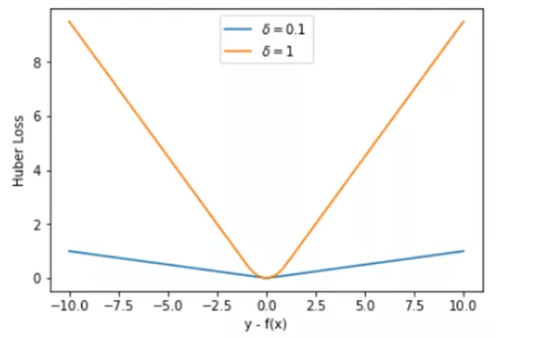 
Huber loss包含了一个超参数 $\delta$。$\delta$ 值的大小决定了 Huber Loss 对 MSE 和 MAE 的侧重性，当 $|y - f(x)| \leq \delta$ 时，变为 MSE；当 $|y - f(x)| \geq \delta$ 时，则变成类似于 MAE，因此 Huber Loss 同时具备了 MSE 和 MAE 的优点，减小了对离群点的敏感度问题，实现了处处可导的功能。
最后我们得到的loss曲线如下：  
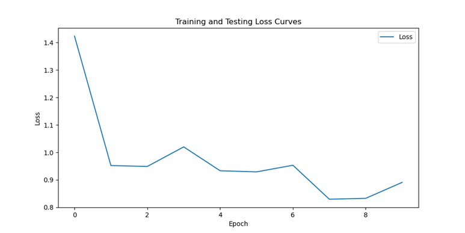

### 3.3.2. 置信度测试
经过测试，由于数据本身存在一定的方差，在不同的sample上模型的表现也不一样，总体来说对于方差较大的数据，预测得到的结果就不太好，对于本身比较精确的结果，模型能有一个比较好的结果。  
这里我们比较了预测数据和原数据之间的MSE，并假定原数据为正态分布，根据已知的均值和标准差对其进行处理，计算输出与真实之间的z-score和p-value并给出置信度。最终得到结果如下：  
Test Loss: 0.9105 | Test Avg Error: 1.2994|Test Avg Confidence: 0.5465  
可以看到模型在测试集上达到的置信度能稳定在55%左右

### 3.3.3. 可视化
我们首先对fMRI切片和预测结果进行了可视化，结果如下：  
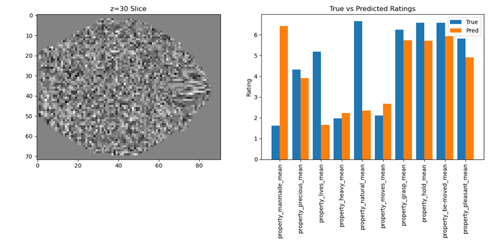
我们测试了多个不同细节模型，包含不同的线性层（3/6），不同的分类维度（是否包含nameability和consistency，这两个维度针对的更多是图像和标签的匹配度），不同的训练策略（包括单纯的AdamW和包含调度器的版本），不同的配patch_size（从(12, 13, 15)到(6,7,5)）。总结来说模型在precious，pleasant，be-moved，hold，grasp上表现明显优于其他维度，在其他维度上模型预测有较大的差值，训练中的损失也大部分来自于其他维度。  
由于使用了自注意力机制来学习fMRI图像的解码，我们还想知道自注意力头都关注了脑区的哪些位置，所以我们进行了相关的可视化，主要关注注意力头在脑区中的响应。  
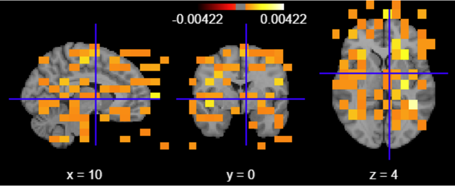
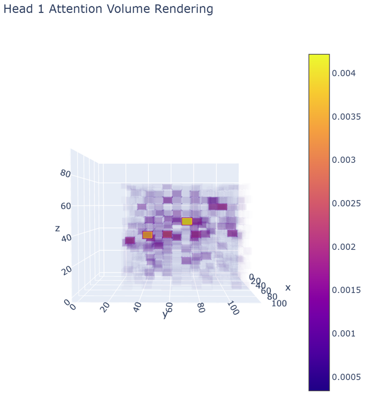

当然我们主要关心的还是自注意力机制都关注了哪些脑区，所以我们将top200的注意力块所在的脑区进行打印并展示占比多寡，得到结果如下：  
=== Top-N Attention Voxels Region Proportions ===  
Background                             : 67.50%  
Middle Frontal Gyrus                     :  0.50%（额中回）  
Inferior Frontal Gyrus, pars triangularis      :  1.00%（额下回岛盖部）  
Inferior Frontal Gyrus, pars opercularis      : 24.00%（额下回三角部）  
Precentral Gyrus                        :  7.00%（中央前回）  

可以看到Background在其中占据了很大一部分，我们认为这是模型训练不充分的结果，没有信息的Background成为了模型自注意力关注的主要部分，但是其他区域例如额中回（MFG）：是所谓“多需求系统”的核心组成部分，负责整合不同认知任务所需的通用执行资源，在多种认知场景下有核心作用<sup>[4]</sup>；额下回岛盖部；负责语义层面的语言理解与加工，是 Broca 区的组成部分；额下回三角部：也是Broca 区的重要组成部分，连接运动皮层，负责编码发音动作程序；中央前回的功能集中于运动，可能与be-moved，hold，grasp等属性相关，考虑到其只占7%，我们可以认为这是模型训练不完全的结果，当然也有可能存在更有意思的结论。

## 3.4. 讨论和可能存在的改进方向
通过构建与训练3D Vision Transformer（ViT3D）模型，较为成功地在体积化的fMRI数据上实现了多维评分的回归预测。取得了55%左右的置信度预测，并在precious，pleasant，be-moved，hold，grasp维度上取得了比较好的置信度。注意力机制的结果也和现有的大脑分区理论有一定的一致性，可以进行进一步的解释。  
尽管如此，模型也存在很多的不足，包括对于Background信息的过分重视；训练loss在下降到0.8左右之后就很难继续优化，而此时预测评分的置信度和精准度并不高；由于算力资源的限制导致每轮epoch我们只使用了采样的固定个batch进行训练，同时并没有实现更小区域的patch_embedding来进一步确认注意力块集中分布的脑区；没有使用大batch_size进行训练，最大每个batch样本数没有超过16。  
为了进一步提升模型性能并拓展应用场景，可以从以下几个方面进行探索和优化：

### 3.4.1. 数据增强
利用基于GAN或变分自编码器的生成模型，基于生成式的方法，扩充稀缺的fMRI样本，模拟不同受试者之间的脑活动差异。或者使用最新的Joint-Embedding Predictive Architecture（JEPA）架构，结合生成式模型和不变性模型的特点，在抽象的表示空间（representation space）中，通过上下文编码器（context encoder）提取已观测区域（context block）的特征表示，再利用预测网络（predictor）预测目标区域（target block）的表示，并将预测结果与由目标编码器（target encoder）生成的“真实”表示进行对齐学习，从而促使模型捕捉更高层次的语义信息。

### 3.4.2. 混合卷积—Transformer架构
如果直接使用全局注意力来捕捉预测变量和自变量之间的关系，计算的开销会非常大（原数据量为491400），我们可以fast-CNN或者其他CNN卷积模型先捕捉多尺度特征，再将得到的多尺度特征输入ViT，在降低计算开销的同时让ViT能够关注到多尺度的信息。

### 3.4.3. 注意力机制改进
- 使用Linear Attention (Linformer/Performer)：用低秩或高效核方法近似全注意力，将空间复杂度从 O(N²) 降到 O(N) 或 O(N log N)，更方便我们处理大体素数fMRI序列。  
- 或者使用局部 + 全局注意力 (HiLo/Swin)：将注意力头分组，一部分做局部窗口注意力、一部分做全局降采样注意力，兼顾局部细节与长程信息

# 4. 对于transformer架构可能的改进：  

## 4.1. 优化思路
在石启垚同学模型基础上，我尝试了混合卷积—Transformer架构：进行transformer编码前，先利用CNN 3D卷积神经网络，提取fMRI数据的局部特征。然后，加入optuna超参数自动优化模块，尝试在一定区间内自动寻找最优超参数并加以运用。在Transformer 编码器结构与前文保持一致时，尝试使用Transformer+CNN和Transformer+CNN+optuna的两种新组合，观察模型性能能否有所改进。

## 4.2. 三种组合分别对应的超参数（确保三种组合中可固定超参数相同）
### 4.2.1. Transformer：
| 模块名称       | 参数设置          | 解释                                   |
|----------------|-------------------|----------------------------------------|
| input_shape    | (72, 91, 75)      | fMRI数据形状（深度×高度×宽度）         |
| patch_size     | (12, 13, 15)      | patch尺寸（需整除input_shape）         |
| embed_dim      | 512               | patch嵌入维度                          |
| num_heads      | 8                 | Transformer头数（多头注意力）           |
| num_layers     | 6                 | Transformer编码器层数                  |
| num_classes    | 12                | 输出评分维度（12维）                   |
| batch_size     | 16                | 批次大小                               |
| lr             | 1e-4              | 学习率（AdamW优化器参数）              |
| epochs         | 12                | 训练轮数                               |
| train_ratio    | 0.8               | 训练集比例（80%训练，20%测试）         |
| batches_to_train | 32           | 每轮训练批次数（子采样，减少计算量）   |
| batches_to_test | 12            | 测试的批次数（子采样）                 |

### 4.2.2. Transformer+CNN：
| 模块名称       | 参数设置          | 解释                                   |
|----------------|-------------------|----------------------------------------|
| input_shape    | (72, 91, 75)      | fMRI数据形状（深度×高度×宽度）         |
| patch_size     | (6, 11, 6)        | patch尺寸（与CNN输出匹配）             |
| embed_dim      | 512               | patch嵌入维度                          |
| num_heads      | 8                 | Transformer头数（多头注意力）           |
| num_layers     | 6                 | Transformer编码器层数                  |
| num_classes    | 12                | 输出评分维度（12维）                   |
| batch_size     | 16                | 批次大小                               |
| lr             | 1e-4              | 学习率（AdamW优化器参数）              |
| epochs         | 12                | 训练轮数                               |
| train_ratio    | 0.8               | 训练集比例（80%训练，20%测试）         |
| batches_to_train | 32           | 每轮训练批次数（子采样，减少计算量）   |
| batches_to_test | 12            | 测试的批次数（子采样）                 |

### 4.2.3. Transformer+CNN+optuna：
| 模块名称       | 参数设置          | 解释                                   |
|----------------|-------------------|----------------------------------------|
| input_shape    | (72, 91, 75)      | fMRI数据形状（深度×高度×宽度）         |
| patch_size     | (6, 11, 6)        | patch尺寸（需整除input_shape）         |
| num_heads      | 8                 | Transformer头数（多头注意力）           |
| num_classes    | 12                | 输出评分维度（12维）                   |
| batch_size     | 16                | 批次大小                               |
| epochs         | 12                | 训练轮数                               |
| train_ratio    | 0.8               | 训练集比例（80%训练，20%测试）         |
| batches_to_train | 32           | 每轮训练批次数（子采样，减少计算量）   |
| batches_to_test | 12            | 测试的批次数（子采样）                 |

## 4.3. 引入3D CNN三维卷积编码（3D CNN Feature Extractor）的介绍
### 4.3.1. 3D CNN的模型架构
- 第一层卷积：  
  Conv3d(in_channels=1, out_channels=32, kernel_size=3, stride=1, padding=1) → BatchNorm3d(32) → ReLU → MaxPool3d(kernel_size=2, stride=2)  
  输入：fMRI 数据（形状：[batch_size, 1, D, H, W]，1 为通道数）  
  输出：[batch_size, 32, D/2, H/2, W/2]（尺寸因池化减半）  

- 第二层卷积：  
  Conv3d(in_channels=32, out_channels=64, kernel_size=3, stride=1, padding=1) → BatchNorm3d(64) → ReLU → MaxPool3d(kernel_size=2, stride=2)  
  输入：第一层输出（形状：[batch_size, 32, D/2, H/2, W/2]）  
  输出：[batch_size, 64, D/4, H/4, W/4]（尺寸再次减半）  

### 4.3.2. 3D CNN发挥的作用
CNN3D作为一个轻量级3D卷积网络，通过两个卷积块提取局部特征并降维，输出与Transformer的Patch尺寸兼容的特征向量。3D CNN可以适配三维数据的空间结构，高效提取局部空间上下文特征，同时通过降维减少计算量，为Transformer提供高质量的局部特征输入。从而使模型能更精准地捕捉fMRI数据中的神经活动模式，最终提升回归任务（如认知评分预测）准确性。然而，具体到本次任务，由于算力有限，batch_size规模仅为16，即所选用训练的数据量过小，加之本机内存过小，因而不得不选用较大的patch_size = (6, 11, 6)，因而最终呈现效果transformer和transformer +CNN暂无明显差异性。

## 4.4. 引入optuna的介绍
Optuna 是一个开源的超参数优化框架，主要解决深度学习中 “手动调参效率低、依赖经验” 的问题。其具有以下三个特点：  
1. 灵活的搜索空间定义：支持整数、浮点数、分类值等多种超参数类型。  
2. 高效的搜索策略：默认使用 TPE（Tree-structured Parzen Estimator）算法，通过历史试验结果动态调整搜索分布，比网格搜索 / 随机搜索更高效。  

## 4.5. 具体实现细节（主要分为目标函数定义、超参数搜索空间设置、模型训练与验证）
1. **目标函数objective**：  
   代码中定义了超参数搜索空间（动态参数），对Transformer+CNN+optuna模型中的三个超参数embed_dim，num_layers，lr进行动态调整，动态调整范围如下：  
   - embed_dim：[256, 512, 768]，分类值Categorical  
   - num_layers：[3,8]，整数int  
   - lr：1e-5, 1e-3, log=True，浮点数Float  
   分别的作用：  
   - embed_dim：Transformer嵌入维度，从候选值中选择（减少搜索复杂度）  
   - num_layers：Transformer编码器层数，探索不同深度对性能的影响  
   - lr：学习率，对数空间搜索覆盖更宽的范围（小学习率更密集）  
   每次试验（trial）会生成一组新的超参数，并用这组参数训练模型，返回验证损失作为优化目标（Optuna会在超参数取值范围内，使损失逐渐最小化）  

2. **optuna优化流程**：  
   - 初始化研究（Study）；  
   - 执行多轮试验（Trials）：每轮试验会调用 objective 函数，生成一组新的超参数，训练并验证模型，记录损失值；  
   - 提取最优超参数：优化完成后，通过study.best_params和study.best_value获取最优超参数和对应的最小损失；  
   - 用最优参数训练最终模型：找到最优超参数后，重新初始化模型（使用最优参数），并全量训练（此处因为算力限制，仅进行和超参数优化时相同迭代次数的训练）  

3. **选用optuna的缺陷**：  
   本次实验由于算力有限，且需要人为调整的超参数（embed_dim，num_layers，lr）数量过少，因而前期调整超参数的迭代次数与调整超参数之后的迭代次数相同，都为12。即无法体现出optuna面对大量超参数时，对超参数进行自动化调整后提高模型训练效率的优势（本次实验前期调整超参数时的迭代次数比重占比过高）。

## 4.6. 模型（Transformer，Transformer+CNN，Transformer+CNN+optuna）结果比较
事实上，因为选用样本量过少，patch尺寸过大(patch_size = (6, 11, 6)),虽然选用patch_size = (6,7,5)能较好地平衡计算效率与性能，然而，本机内存有限，选用patch_size = (6,7,5)时主机内存不够，因而求其次。同时，由于3D CNN卷积的作用，输入vit 3D时的图像数据结构发生改变，因而Transformer模型patch_size = (12,13,15),相比余下两个模型有较大差异。 
事实上，单从运行结果看，引入 3D CNN 和 optuna 之后模型性能基本没有明显提升————vit3D(Transformer)在引入 3D CNN 后，Test Loss从每次迭代时在>0.09附近波动，更新至在>0.08附近波动，Transformer+CNN+optuna相比Transformer+CNN，基本没有变化，甚至略有上升。
推测可能原因如下：
1. patch_size = (6, 11, 6)，偏大，导致模型无法进一步获取图像更细节的信息特征
2. 本次尝试的三个模型都未考虑正则化项，导致模型在固定学习率lr = 1e-4时，可能学习率过大，反映到Training and Testing Loss Curve中时，即为Transformer和Transformer+CNN的损失曲线并未随着迭代次数的上升而稳定下降，更多的是呈现出了某种周期性波动的结果。然而，Transformer+CNN+optuna中，利用optuna迭代12次后得到的最优超参数中，学习率lr =  6.13*1e-4，与前两组模型的学习率为同一数量级。因而，推测在当前数据集规模下，以Transformer为核心架构的vit 3D模型模型性能具有一定上限，该上限为Loss = 0.08。
3. 参考前文石启垚同学所提到的，图像本身的特征维度评分是人为进行的，意味着图像本身真实的维度数据在进行评估初期，就具有一定的方差，因而模型Loss具有一定的上限值，无法再继续提升，使之与现实情况更好地吻合。

### 4.6.1 Transformer：  
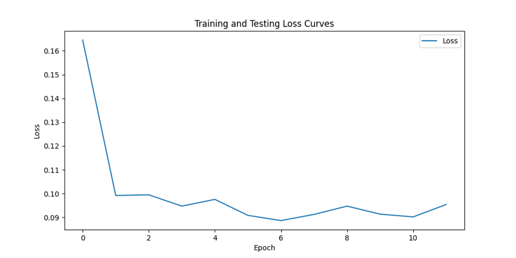 
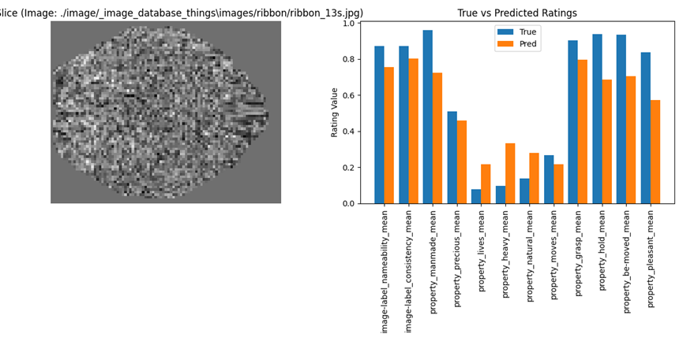
Test Loss: 0.0922 | Test Avg Error: 0.2503

#### 4.6.2 Transformer+CNN：  
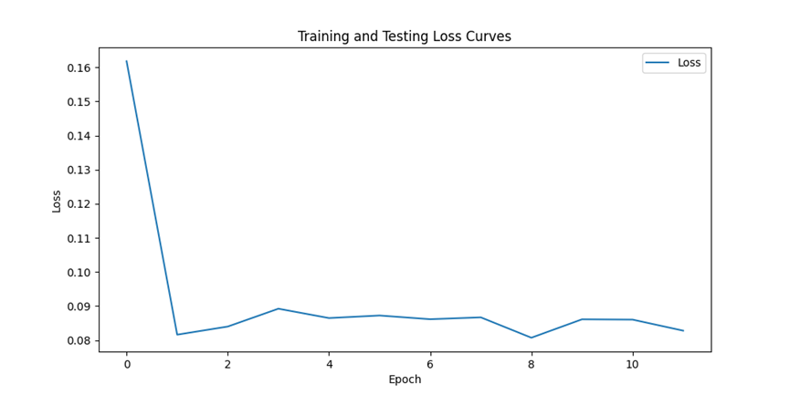 
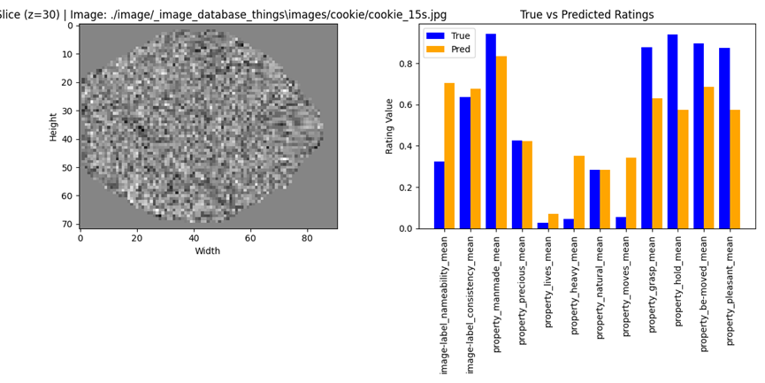
Test Loss: 0.0823 | Test Avg Error: 0.2511

#### 4.6.3. Transformer+CNN+optuna：  
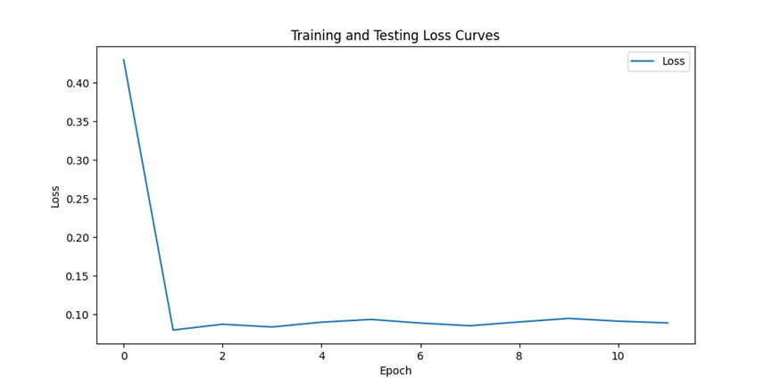
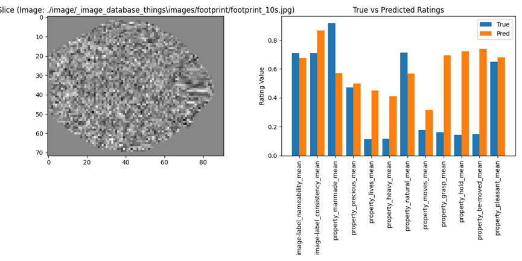
最优测试损失: 0.0732
最优参数: {'embed_dim': 768, 'num_layers': 7, 'lr': 6.13*1e-4}
Test Loss: 0.0887 | Test Avg Error: 0.2504

# 5. 模型可能的改进方法（理论）
若vit 3D(Transformer)模型本身就能较好的完成任务，使之达到Loss存在的上限，那我们要对模型进行优化时，可能需要考虑的就不仅仅是fMRI数据的预处理（3D CNN卷积层），更多的，需要考虑使用更大更丰富的数据集，或者对vit 3D(Transformer)本身的架构进行优化。前者以我们当前的算力资源，较难实现，而后者，在文献*Functional boundaries in the human cerebellum revealed by a multi-domain task battery*中，我找到了一种有趣的方法

## 5.1. 文献方法介绍：
### 5.1.1. 方法简要概括：
凸半非负矩阵分解CSNM<sup>[5]</sup>，生成功能分区：\(V \approx W \cdot H\)

- 任务 - 体素矩阵 \( V \) 维度：\( N \times P \)（任务条件数量 × 小脑体素数量）  
- 任务 - 功能区域矩阵 \( W \) 维度：\( N \times Q \)（任务条件数量 × 功能区域数量）（允许正负）  
- 功能区域 - 体素矩阵 \( H \) 维度：\( Q \times P \)（功能区域数量 × 小脑体素数量）（非负）  

优化方式：\(\min_{W,H} \| V - W \cdot H \|_F^2\) 

### 5.1.2. 方法详细介绍
CSNM是一种针对多尺度特征融合的优化技术，主要用于解决多尺度特征间的信息对齐与有效融合问题。其核心思想是：通过匹配不同尺度特征的局部邻域信息，建立跨尺度的关联关系，从而让模型同时捕捉细粒度细节（小尺度）和全局上下文（大尺度）的信息。

实现思路：
1. 统一维度：不同尺度的特征可能因 Patch 大小不同，导致嵌入维度不一致
2. 分辨率对齐（Resolution Alignment）：不同尺度的特征分辨率（如空间尺寸）不同（例如，细尺度特征分辨率高，粗尺度分辨率低）。通过三线性插值（nn.functional.interpolate），可以将不同尺度的特征对齐到同一分辨率，便于后续邻域匹配 
3. 邻域相似性计算（Neighborhood Similarity）：使用卷积层（sim_conv）提取每个位置的邻域特征，计算邻域特征的余弦相似性，衡量两个尺度下同一位置邻域的相似程度。
4.  加权融合（Weighted Fusion）：高相似区域：保留原尺度特征（例如，细尺度的细节与粗尺度的上下文一致时，增强该区域的表达）。低相似区域：通过跨尺度信息互补（例如，细尺度细节与粗尺度上下文冲突时，融合两者以修正误差）。

## 5.2. 文献方法可能的应用：
在本次 fMRI 回归任务中，由于 fMRI 信号同时包含局部脑区激活（如 V1 区对视觉刺激的响应，需小尺度 Patch）和全局功能网络（如默认模式网络，需大尺度 Patch），所以可以考虑通过跨尺度邻域匹配，使得模型捕捉局部激活与全局网络的关联，从而更准确地预测图像的语义评分（如 “可命名性”“自然属性” 等）。

注：尝试了向vit_regression中添加CSNM模块，来验证是否能达到更好的效果，但中途代码出了一些问题，没能解决…………

# 6. 不使用vit，使用三种其他分类器结果

## 6.1. 流程：
1. 数据处理  
2. 模型构建与训练：  
  构建从beta图到图像类别的预测模型，实现分类任务。借鉴week6的动物/工具分类任务，首先选用逻辑回归模型作为基线，后续尝试多层感知机（MLP）与三维卷积神经网络（3D CNN）。将数据集分成训练、验证和测试集，分别用于模型训练、调参与性能评估。  
3. 维度分析：探索哪些神经维度或脑区对于分类任务最为关键，为后续脑区贡献度分析提供可能方向(详情可参考石启垚同学的“1.3.3.可视化”部分)

## 6.2. Label到idx映射Label2Int.py：
实验中使用脚本读取所有类别标签并进行编号，构建一个字典将标签与整数索引相互映射，以便于在训练过程中使用整数作为类别标识。

# 7. 三种分类器具体介绍
## 7.1. Logistic分类：
### 7.1.1. 数据处理：
使用 FMRIClassificationDataset 对原始 fMRI 数据进行降采样并展平：
```
fmri = sample['fmri'].squeeze(0)[::2, :2:, ::2].flatten()
```
将数据集按大约7:1:2的比例切分成训练集、验证集和测试集

### 7.1.2. 模型结构：
Logistic 回归模型(LogisticRegressionClassifier)由一个线性全连接层组成，输出为未归一化的 logits，后续通过 softmax 转换为概率。

### 7.1.3. 训练配置：
| 参数         | 值              |
|--------------|-----------------|
| 损失函数     | CrossEntropyLoss |
| 优化器       | Adam            |
| 学习率 lr    | 1e-3            |
| Batch size   | 4               |
| epoch        | 5               |

### 7.1.4. 训练效果评估：
可视化训练集和验证集的损失变化趋势，在测试集上测试Top-K准确率（选择模型输出最有可能的K个类别，若真实类别在这K个类别中则认为正确），这里K取10。选择Top-K是因为模型训练效果较差，K=1即为预测出准确的类别，但Top-1 准确率极低，因此选择 Top-10 以反映模型对类别的大致区分能力。
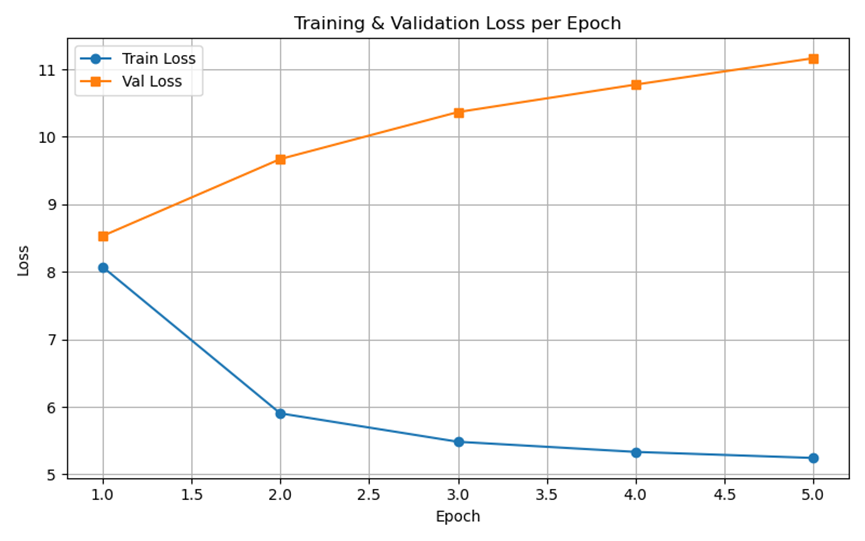
 测试集Top-10准确率 1.27%

## 7.2.	MLP分类器：
### 7.2.1. 数据处理
加载数据与Logistic分类相同，使用展平的 fMRI 向量作为输入。

### 7.2.2. 模型结构 MLPClassifier ：
使用多层感知机MLP作为分类器，输入层维度由fMRI展平后维度决定，隐藏层包括：512单元+ReLU激活+Dropout，输出维度等于类别数。

### 7.2.3. 训练配置：
| 参数         | 值              |
|--------------|-----------------|
| 损失函数     | CrossEntropyLoss |
| 优化器       | Adam            |
| 学习率 lr    | 1e-3            |
| Batch size   | 4               |
| epoch        | 5               |

### 7.2.4. 训练效果评估：
绘制训练与验证损失变化曲线，计算测试集的 Top-10 准确率：

测试集Top-10准确率：1.91%

## 7.3. CNN：
### 7.3.1. 加载数据：
读取fMRI数据并进行降采样，不再进行展平，而是保留其三维结构用于 CNN 输入。训练阶段增加了轻微高斯噪声作为数据增强手段，以缓解过拟合。

### 7.3.2. 模型结构：
1. 卷积部分：
使用3×3×3卷积核逐步提取空间信息，BatchNorm3d加快收敛，池化层降维、提取局部特征，最后将输出压缩成一个特征向量：
```
nn.Sequential(
    nn.Conv3d(1, 32, 3, padding=1),
    nn.BatchNorm3d(32),
    nn.ReLU(),
    nn.MaxPool3d(2),
    nn.Conv3d(32, 64, 3, padding=1),
    nn.BatchNorm3d(64),
    nn.ReLU(),
    nn.MaxPool3d(2),
    nn.Conv3d(64, 128, 3, padding=1),
    nn.BatchNorm3d(128),
    nn.ReLU(),
    nn.AdaptiveAvgPool3d(1, 1, 1)
)
```  
2. 全连接部分：
将卷积提取的语义表示映射到具体类别预测，dropout防止过拟合：
```
nn.Sequential(
    nn.Linear(flattened_size, 256),
    nn.ReLU(),
    nn.Dropout(0.3),
    nn.Linear(256, num_classes)
)
```
### 7.3.3. 训练配置：

| 参数         | 值              |
|--------------|-----------------|
| 损失函数     | CrossEntropyLoss |
| 优化器       | Adam            |
| 学习率 lr    | 1e-3            |
| Batch size   | 4               |
| epoch        | 5               |

### 7.3.4. 评估训练效果：
可视化训练集和验证集的损失变化趋势，在测试集上测试Top-10 准确率。
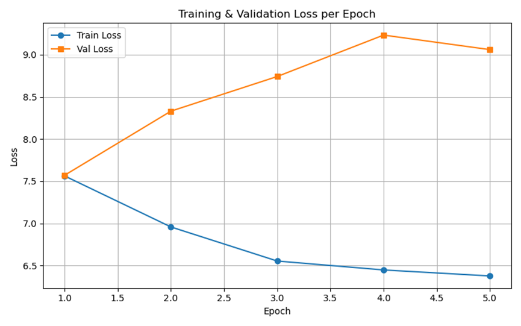
测试集Top-10准确率：0.64%

# 8. 三种分类器训练结果
## 8.1.	效果分析：
因为数据过大且算力有限选择降采样，这在一定程度上导致信息丢失；而类别较多、训练数据较少使得模型很容易出现过拟合。因此实验效果整体较差。
## 8.2. 本次实验三种模型对比：
| 模型   | 空间结构 | 参数复杂度 | 训练速度 | 数据形状 | 过拟合程度（存疑） |
|--------|----------|------------|----------|----------|--------------------|
| Logistic | ×        | 低         | 快       | 扁平向量 | 高（可能是欠拟合） |
| MLP    | ×        | 中         | 较快     | 扁平向量 | 较高               |
| 3D CNN | √        | 高         | 慢       | 3D数据   | 较高               |

1. Logistic 回归：作为线性模型，建模能力有限，不能捕捉复杂的神经表示。在类别数较多、样本有限的设定下，容易出现欠拟合。
2. MLP：引入非线性和 Dropout，性能略优于 Logistic 回归，但仍未考虑空间结构，因此泛化性能仍受限。
3. 3D CNN：能够建模空间信息，理论上具备更强的表示能力与泛化能力，但对 batch size 和输入尺寸敏感，训练成本高，且在小数据场景下易过拟合。

# 9. 关于训练过程过拟合现象的观察和解释：
理论上模型越复杂越容易在小数据集上出现过拟合，但实验展示出的与预期相反：虽然都满足训练loss一直降低、验证loss一直升高的情况，但CNN模型验证loss升高最缓慢而Logistic升高最快。可能的解释有：
1.	验证loss上升并不是过拟合而是欠拟合：
由于数据维度高、类别数量大，但训练数据规模有限，且 epoch 仅为 5，模型可能尚未真正收敛；特别是对参数较多的 CNN 而言，其训练速度慢于 Logistic 回归，因此更可能处于训练早期。
因此，训练 loss 下降而验证 loss 上升，可能是由于模型尚未在验证集泛化，而不是典型意义上的过拟合。也有可能Logistic收敛到一个欠拟合的局部最优，而CNN模型还没到过拟合的阶段。
2.	在CNN模型中加入了噪声，强化了模型的鲁棒性，起到了防止过拟合的效果。

## 补充说明：epoch增大至10后三种分类器效果
Logistic:
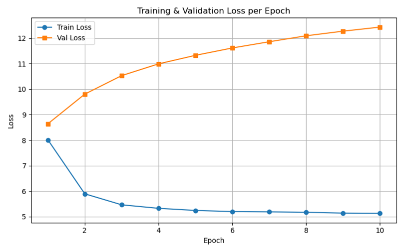
MLP：
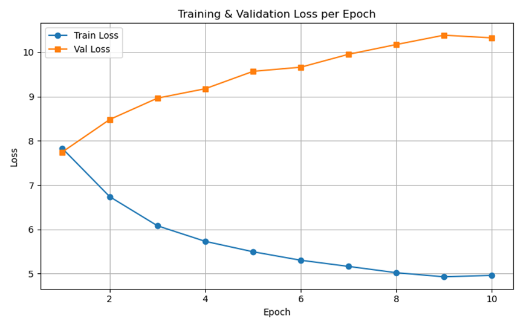
CNN：
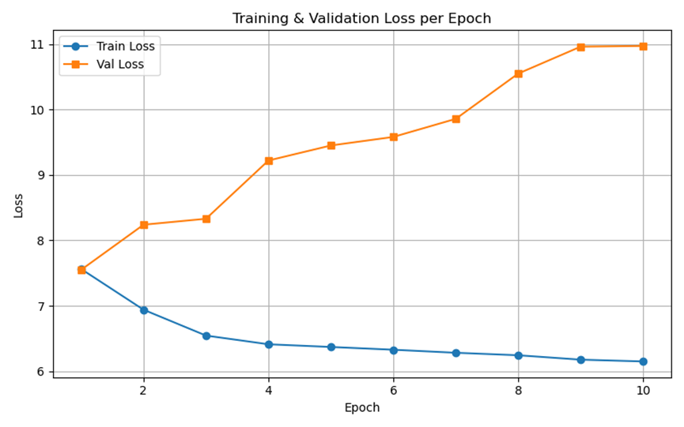
可以看到基本还是保持和epoch=5时的趋势：训练loss下降而验证loss上升。对logistic和mlp模型训练loss接近平滑，这可能意味着这两类模型在小样本高维度设定下容易收敛到局部最优解，且由于表达能力有限，进一步训练也难以获得更好的拟合或泛化性能。相比之下，CNN 模型的训练过程较为缓慢，loss 曲线下降幅度更小，可能仍处于“未充分训练”阶段。但验证 loss 依旧保持上升，或许很难达到更好的训练效果。

# 10. 后续优化方向：
可以在算力条件满足的情况下尝试增加epoch，观察验证 loss 是否出现“先下降再上升”的拐点，进一步确认是否处于欠拟合；引入 Early Stopping，防止训练过度导致真正的过拟合；增大训练数据量、添加L2正则化、调整batch size或许能提升模型泛化能力。

#### 个人代码分工详情
此处已给出每个人所用代码对应的压缩包
其中，李瑞林的*THINGSfastdataset.py*，*4.6.1_vit.py*的初版代码源于石启垚同学

#### 全文写作分工详情
- 石启垚：正文1-3部分
- 郎楚涵：正文6-10部分
- 李瑞林：正文4-5部分，组员结果汇总

注：每人的写作分工可与代码分工相对应，特别的，正文“2.1. THINGS数据集”由石启垚和郎楚涵同学共同完成。

#### 参考文献：
1. Y. Takagi and S. Nishimoto, "High-resolution image reconstruction with latent diffusion models from human brain activity,"2023 IEEE/CVF Conference on CVPR
2. Schneider, S., Lee, J.H. & Mathis, M.W. Learnable latent embeddings for joint behavioural and neural analysis. Nature
3. Hosseini E, Casto C, Zaslavsky N, Conwell C, Richardson M, Fedorenko E. Universality of representation in biological and artificial neural networks. bioRxiv
4. Koyama, M.S., O’Connor, D., Shehzad, Z. et al. Differential contributions of the middle frontal gyrus functional connectivity to literacy and numeracy. Sci Rep 7, 17548
5. King M, Hernandez-Castillo CR, Poldrack RA, Ivry RB, Diedrichsen J. Functional boundaries in the human cerebellum revealed by a multi-domain task battery. 